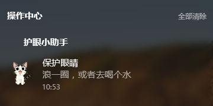

# A desktop notification gadget

由于长时间工作，导致用眼过度，眼睛经常干涩、遍布血丝。和朋友聊天的时候也聊起过这个问题，然后就想着实现一个定时提醒的桌面小工具，想起来 HTML5 有 Notification 的 API 但是考虑了一下，它需要一直打开浏览器而且非服务状态下无法发起通知，后来经过了解发现 **Electron** 可以实现桌面UI，尝试着实现了一个 **“桌面小工具”**

---

**Electron 官网：** [http://electron.atom.io/](http://electron.atom.io/)

**简介:**

    使用 JavaScript, HTML 和 CSS 构建跨平台的桌面应用。

    如果你可以建一个网站，你就可以建一个桌面应用程序。 
    Electron 是一个使用 JavaScript, HTML 和 CSS 等 Web 技术创建原生程序的框架，
    它负责比较难搞的部分，你只需把精力放在你的应用的核心上即可。


## 使用技术


基于nodejs + Electron + asar + js + html + css

## 如何运行

```
git clone https://github.com/linxsbox/DesktopNotification.git

cd DesktopNotification

npm install

npm run dev
```

**构建桌面客户端**

```
npm run asar // 资源文件打包

npm run pack // 生成桌面客户端
```

## 另外说明

> - Electron 生成客户端后体积略大，网上也有压缩方案，但都是基于加壳压缩，会导致部分杀软或者xx管家类的误报。
> - 目前个人使用的是比较偷懒的方式：生成客户端后->运行exe->除资源文件外全选删除->提示文件被占用后选择跳过。可得到 **120+M** 左右客户端 **(体积约减少40%)** 主要体积在在EXE文件上

## 项目截图

**客户端界面**


**右下角通知**


**操作中心通知**

